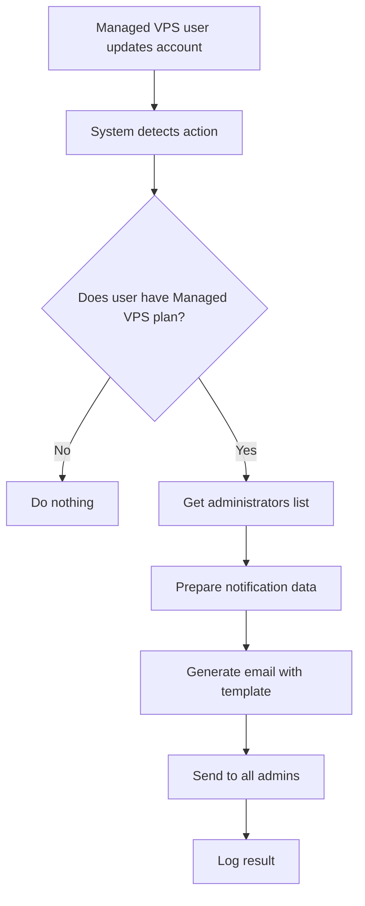

# Administrator Notifications for Managed VPS

## Description

This functionality allows sending automatic email notifications to all system administrators when a user who has the **"IPTRADE Managed VPS"** service makes updates to their trading accounts.

## Features

### ✅ Implemented Functionalities

- **Automatic detection**: The system automatically detects when a user with "IPTRADE Managed VPS" plan makes changes
- **Multi-administrator notification**: Sends emails to all users with "admin" or "superadmin" role
- **Detailed information**: Includes complete user information and update details
- **Custom template**: Uses a professional HTML template specifically designed for these notifications
- **Complete logging**: Records all activities for auditing

### 📧 Notification Types

Notifications are sent for the following actions:

1. **Account creation** (`created`)
2. **Account update** (`updated`)
3. **Account deletion** (`deleted`)

### 📋 Included Information

Each notification includes:

**User Information:**

- User name
- Email
- Subscription plan
- User ID

**Update Details:**

- Type of action performed
- Affected account ID
- Account number
- Platform (MT4, MT5, etc.)
- Account type (Master, Slave)
- Exact date and time

## Technical Implementation

### Modified/Created Files

1. **`lib/db/queries.ts`**

   - Added `getAdminUsers()` function to get all administrators

2. **`lib/email/services.ts`**

   - Added `sendManagedVPSUpdateNotificationToAdmins()` function

3. **`lib/email/templates.ts`**

   - Added `managedVPSAdminNotificationTemplate()` function

4. **`lib/db/actions.ts`**

   - Modified functions:
     - `createTradingAccount()`
     - `updateTradingAccount()`
     - `deleteTradingAccount()`
   - Added helper function `notifyAdminsIfManagedVPS()`

5. **`email-templates/managed-vps-admin-notification.html`**

   - New professional HTML template for notifications

6. **`app/api/admin/test-managed-vps-notification/route.ts`**
   - Test endpoint to verify functionality

### Workflow



### Sending Conditions

Notification is sent ONLY when:

- ✅ User has `"IPTRADE Managed VPS"` plan
- ✅ Subscription status is `"active"`, `"trialing"` or `"admin_assigned"`
- ✅ At least one administrator user exists in the system
- ✅ Action is one of: `created`, `updated`, `deleted`

### Email Configuration

Uses the same system email configuration:

- Support for **Resend** (recommended) or **Nodemailer** (fallback)
- Respects development/production configurations
- Error handling without blocking main operation

## How to Test

### 1. Test Endpoint

```bash
POST /api/admin/test-managed-vps-notification
Content-Type: application/json
Authorization: Bearer <admin-token>

{
  "action": "updated",
  "accountNumber": "123456789",
  "platform": "mt5",
  "accountType": "master"
}
```

### 2. Real Test

1. Create a user with "IPTRADE Managed VPS" plan
2. Ensure the user has "active" status
3. Create, update or delete a trading account for the user
4. Verify that administrators receive the email

### 3. Log Verification

Search in server logs:

```
Managed VPS user [email] [action] account, admins notified
Sent Managed VPS update notification to X/Y admins
```

## Configuration

### Environment Variables

The functionality uses the following existing variables:

- `NEXT_PUBLIC_APP_URL`: Base URL for links in the email
- `RESEND_API_KEY` or SMTP configuration: For email sending

### User Roles

- `admin`: Receives notifications
- `superadmin`: Receives notifications
- `member`: Does not receive notifications (regular users only)

## Security and Performance

### Security Features

- ✅ **Permission validation**: Only users with active Managed VPS plan trigger notifications
- ✅ **Administrator filtering**: Only users with admin/superadmin role receive emails
- ✅ **No sensitive data exposure**: Passwords are never included in notifications

### Performance Optimization

- ✅ **Non-blocking operation**: Email errors don't block main operations
- ✅ **Dynamic imports**: Email modules are loaded only when needed
- ✅ **Error handling**: Individual failures don't affect other notifications
- ✅ **Efficient logging**: Only important events are recorded

## Maintenance

### Recommended Monitoring

1. **Sending logs**: Regularly check notification logs
2. **Administrator status**: Ensure active admin users exist
3. **Email configuration**: Verify email service is working

### Possible Future Improvements

- [ ] **Configuration panel**: Allow admins to subscribe/unsubscribe
- [ ] **Advanced filters**: Allow filtering by action type or user
- [ ] **Daily digest**: Option to receive daily summary instead of immediate notifications
- [ ] **Webhooks**: Support for webhook notifications in addition to email
- [ ] **Customizable templates**: Allow customizing template from admin panel

---

## Email Examples

### Email Subject

```
[Managed VPS] Account Updated - John Doe
```

### Content (Summary)

```
Hello Admin,

A Managed VPS service user has made changes to their trading accounts.

USER INFORMATION:
- Name: John Doe
- Email: john.doe@example.com
- Plan: IPTRADE Managed VPS
- User ID: abc123...

UPDATE DETAILS:
- Action: updated a trading account
- Account Number: 1234567890
- Platform: MetaTrader 5
- Account Type: Master
- Date and Time: 12/15/2024 14:30:45

[View Managed Users]
```

---

**Note**: This functionality is completely automatic and requires no manual intervention once implemented.
